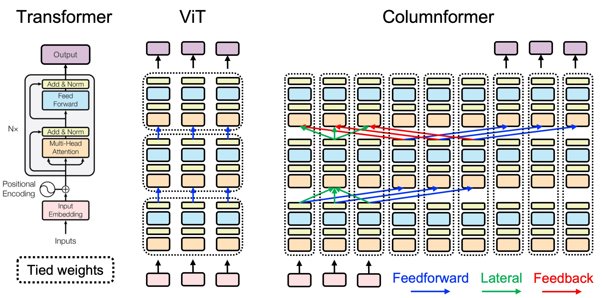
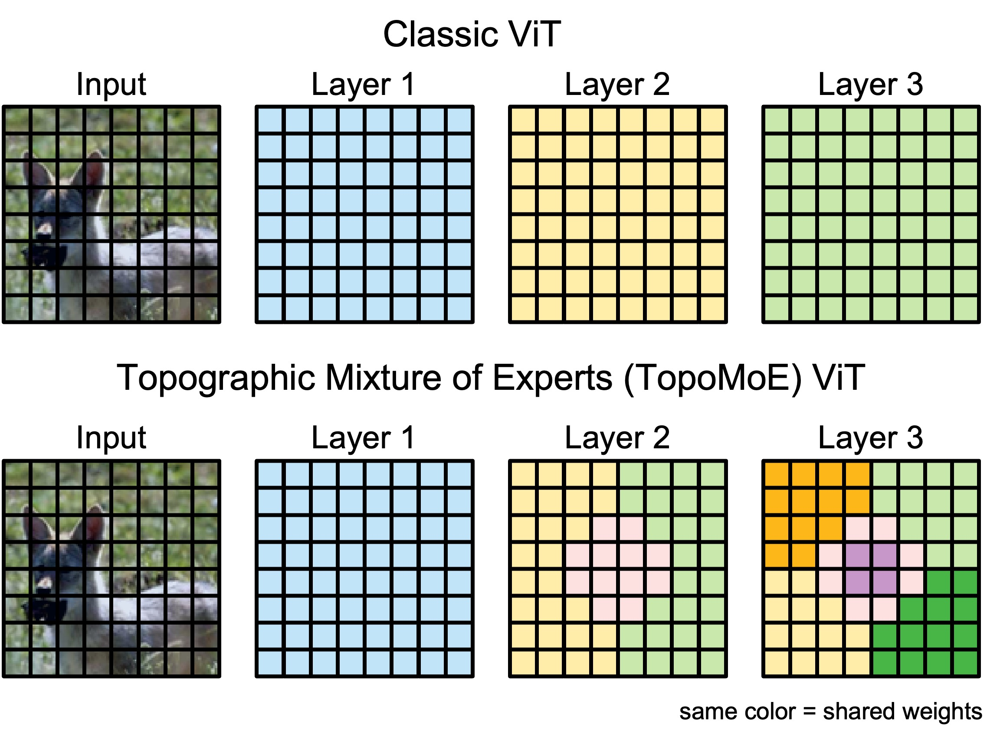

# Getting Started

This document provides a brief orientation to the code and instructions for installation.

## Projects

We have two ongoing projects organized into separate source directories

- [columnformers](columnformers): Introduces the "Columnformer" ViT architecture which consists of a single ViT block with untied weights across token positions and recursive unrolling (i.e. depthwise weight sharing) similar to the [Universal Transformer](https://arxiv.org/abs/1807.03819).

<p align="center">
  
</p>

- [topomoe](topomoe): Introduces the Topographic Mixture-of-Experts (TopoMoE) ViT architecture. Each block consists of one or more experts, each of which is assigned to an area of the patch grid.

<p align="center">
  
</p>

## Installation

To get started working with the code, you can fork the repo and install the projects in a local environment:

```bash
python3 -m venv .venv
source .venv/bin/activate

pip install -U pip
pip install -r requirements.txt

pip install -e ./columnformers
pip install -e ./topomoe
```

If you want to contribute changes, please also install the pre-commit hooks

```bash
pre-commit install
```
