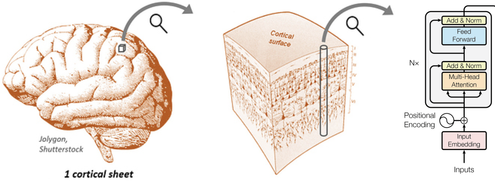

# Columnformer: A Transformer-inspired model of the brain

Transformers are amazing models. Could they be useful models of the brain? At a fine scale, the "columns" of a transformer somewhat resemble cortical columns. Zooming out however, the large-scale architecture of the transformer is pretty different from the brain:

- In a transformer, the columns are arranged in a sequence. In the brain, they are arranged on a 2D folded cortical sheet.
- A transformer is "narrow" with a typical column count (i.e. sequence length) of ~104. The brain is "wide" with ~106 columns.
- A transformer has dense all-to-all connectivity between columns. The brain has sparse connectivity with mostly local and some long-range connections.
- Each column in a transformer layer shares weights. Weight sharing between columns in the brain is not possible.
- A transformer consists of multiple independent layers (i.e. blocks) applied sequentially. The brain consists of a single layer of columns (the cortex) applied recurrently.

Here we try to design a transformer-like architecture that closes some of these gaps. We call our model a **Columnformer** (for now).

## Model architecture

- The model consists of a single large layer of "columns".
- Each column consists of an attention and an MLP module, like a transformer.
- Unlike a transformer, columns do not share weights.
- The model is recurrent. The layer is applied to the input recursively for `depth` steps.

Effectively, the attention module implements communication between columns, while the MLP implements computation within a column (cf [Karpathy on Transformers](https://youtu.be/XfpMkf4rD6E?si=iT1_bXOyhfb7_tJ8&t=1389)). To promote sparse, structured communication between columns, we also:

- Embed columns in a geometric space. E.g. on a 2D grid or sphere.
- Penalize the "wiring cost" of the attention map with respect to this geometry.

## Questions

### Emergence of brain-like connectivity

The proposed model is highly flexible. Only the geometry of the column layer constrains the learned connectivity pattern (cf [Geometric constraints on brain function]((https://www.nature.com/articles/s41586-023-06098-1))). This raises interesting questions:

- What sorts of connectivity patterns does the model learn?
- Will we see spontaneous emergence of functional hierarchy?  Feedback connections? Topographic organization? Functional specialization?
- What kinds of geometries and wiring cost penalties lead to more brain-like connectivity?
- Is it possible to *learn* an optimal geometry?

### Impact of weight sharing

Both the transformer and the columnformer have a width (the number of columns) and a depth (the number of compute steps). One key difference is that the Transformer shares weights across width, whereas the columnformer shares weights across depth (through recurrence). What impact does this have on model performance?

- Because width >> depth, columnformers have many more parameters than transformers, therefore less inductive bias. Will columnformers even learn?
- How hard is it to get the untied columns in a columnformer to "agree" on a latent feature space? Do we need some penalty term to promote feature consistency (e.g. [feature smoothness](https://arxiv.org/abs/2308.09431))?

### Sparsity

Brain activity patterns and connectivity patterns are both highly sparse. Likewise, it will be important to leverage sparsity in columnformers as we scale the number of columns. What's the best way to approach this?

- Should we try to hand-design sparse connectivity patterns?
- Can we learn sparse connectivity patterns? What about some kind of progressive model training, where we alternate between training, pruning connections, and scaling the model?
- Will it be useful to promote sparsity over the column activations (cf [sparse mixture-of-experts](https://arxiv.org/abs/1701.06538))?
- Could activation sparsity emerge spontaneously?

## Related work and inspiration

- Lu, Zejin, et al. [End-to-end topographic networks as models of cortical map formation and human visual behaviour: moving beyond convolutions.](https://arxiv.org/abs/2308.09431) arXiv (2023).

- Doshi, Fenil R., and Talia Konkle. [Cortical topographic motifs emerge in a self-organized map of object space.](https://doi.org/10.1126/sciadv.ade8187) Science Advances (2023).

- Margalit, Eshed, et al. [A Unifying Principle for the Functional Organization of Visual Cortex.](https://www.biorxiv.org/content/10.1101/2023.05.18.541361v1) bioRxiv (2023).

- Pogodin, Roman, et al. [Towards biologically plausible convolutional networks.](https://proceedings.neurips.cc/paper/2021/hash/746b02b6680562f44ad7526675bac026-Abstract.html) NeurIPS (2021).

- [Capsule networks](https://proceedings.neurips.cc/paper_files/paper/2017/hash/2cad8fa47bbef282badbb8de5374b894-Abstract.html)

- [Sparse Mixture-of-Experts](https://arxiv.org/abs/1701.06538)

- [Geoff Hinton on The Robot Brains Podcast](https://www.therobotbrains.ai/geoff-hinton-transcript-part-one)
