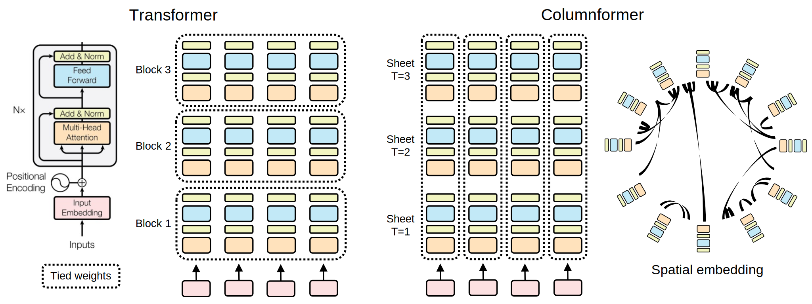
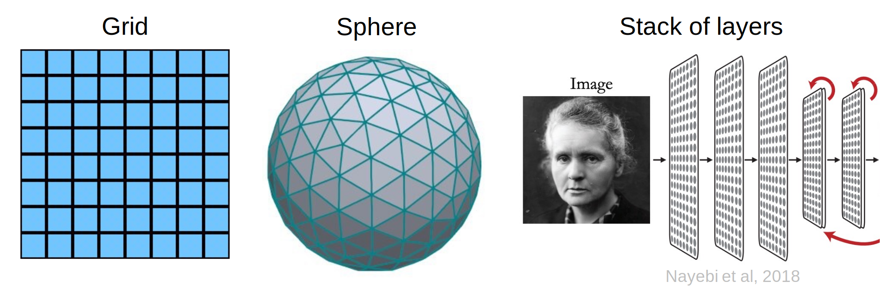

# Columnformer: A Transformer-inspired model of the brain

<p align="center">
  
</p>

**Work in progress, feedback and collaboration welcome!**

## Motivation

Transformers have been very successful. Could they be useful models of the brain? At a fine scale, the transformer module somewhat reminds us of cortical columns. They receive vector input, do some computation, and produce vector output. Following this analogy, we adapt the transformer to make the overall architecture more brain-like:

- We untie weights across the modules in each block. (The brain doesn't share weights.)
- We flatten the blocks into a single sheet. (Like the cortex.)
- During a forward pass, we unroll the sheet for several time steps. (The brain is recurrent.)
- We spatially embed the sheet and promote local communication. (Connectivity in the brain is mostly local.)

We call our architecture the **columnformer**.

<p align="center">
  
</p>

We think the architecture is interesting because of two key properties:

- **Topography**. By untying weights and embedding the columns spatially, the model has the potential to learn topographic functional specialization, as seen in the primate ventral visual stream.

- **Recurrence**. Most popular neural network architectures, including the transformer, are purely feedforward. By recursively unrolling the sheet, the columns of our model can communicate in any direction: feedforward, feedback, lateral, etc.

<!-- You could ask, is there even a well-defined feedforward direction? Indeed, any feedforward direction is determined only by the geometry and where input is injected. -->

## Architecture details

See [`columnformer.py`](columnformers/models/columnformer.py) for the implementation of our initial model. In short, the model "sheet" is just a transformer block but with untied weights across the sequence. Each "column" in the sheet consists of an Attention and MLP module preceded by LayerNorm. The Attention module handles communication between columns, while the MLP does within-column computation.

To save parameters, we make a few changes to the Attention and MLP:
  - We use a single attention head
  - We eliminate the value weights and instead set the value to be the input
  - We use a small MLP hidden dimension

<!-- The largest best performing transformers use many attention heads and a large MLP hidden dimension. In our case, we shouldn't need to do this since the columns are untied. Our effective number of heads and MLP hidden dimension scales with the number of columns. -->

We also add a learned bias to our Attention (`attn = softmax(q @ k.T + bias)`), which encodes the learned connectivity between columns.

The key final part of the architecture is a fixed distance matrix encoding the geometry of the sheet. For example, this could be the Euclidean distance matrix computed from a fixed embedding. E.g. a flat 2D grid, spherical mesh, or a stack of 2D layers.

<!-- We could even generalize the distance matrix to arbitrary directed graph edge weights. This would let us encode feedforward architectures as a special case. -->

<p align="center">
  
</p>

We use the distance matrix to promote local communication in two ways:

1. By initializing the attention bias (e.g. `bias = -dist**2`).
2. By penalizing the total "wiring cost" of the attention matrix (e.g. `cost = (dist * attn).mean()`).

Effectively, the geometry of the sheet constrains how information can flow through the network.

## Questions

- Can we train the model?
- Can we get decent task performance?
- What kinds of connectivity will the model learn?
- What kinds of topographic structure will emerge?
- What kinds of geometries, initialization, and regularization promote more brain-like connectivity and topography?
- How do dataset and task impact connectivity and topography?
- How well do the learned representations match brain activity data?
- Does the architecture have any advantages over the transformer, e.g. in task performance, robustness, scalability, or interpretability?

<!-- How could this architecture be better than the transformer?

- Maybe the recurrence (unbounded compute depth, feedback driven refinement) improves performance/robustness.
- Maybe the spatial embedding and local communication lends itself well to large-scale distributed training/inference
- Maybe topographic organization is more interpretable. -->

## Roadmap

### Short-term

- [x] Initial model implementation ([`columnformer.py`](columnformers/models/columnformer.py))
- [x] Get benchmark image classification dataset ([ImageNet-100](https://huggingface.co/datasets/clane9/imagenet-100))
- [x] Implement image classification train/eval pipelines ([`train.py`](columnformers/train.py), [`train_playground.ipynb`](notebooks/train_playground.ipynb), [colab](https://colab.research.google.com/github/clane9/columnformers/blob/main/notebooks/train_playground.ipynb))
- [x] Get baseline performance ([`RESULTS.md`](RESULTS.md))
- [ ] Iterate to understand and improve performance

### Longer-term

- [ ] Research related work (in progress [here](related_work))
- [ ] Implement pre-training for other tasks/datasets
- [ ] Analyze learned topography and connectivity
- [ ] Evaluate brain activity encoding performance
- [ ] Evaluate robustness
- [ ] Efficient implementation, e.g. [sparse attention](https://github.com/facebookresearch/xformers/blob/40d39673285217d9c6b9a0e01e8809a10b771209/xformers/components/attention/random.py#L40)
- [ ] Explore strategies for model scaling, e.g. leveraging sparse connectivity

## Contributing

This project is under active development in collaboration with [MedARC](https://www.medarc.ai/) and we welcome contributions or feedback! If you're interested in the project, please get in touch on [discord](https://discord.com/invite/CqsMthnauZ).

To get started working with the code, you can fork the repo and install the project in a local environment:

```bash
python3 -m venv .venv
source .venv/bin/activate

pip install -U pip
pip install -r requirements.txt
pip install -e .
```

If you want to contribute changes, please also install the pre-commit hooks

```bash
pre-commit install
```

## Related work

See [RELATED_WORK.MD](related_work/RELATED_WORK.md).
